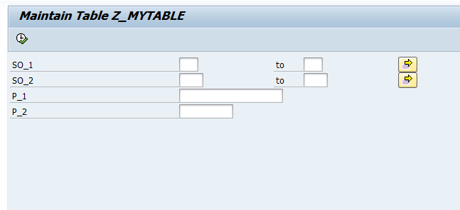
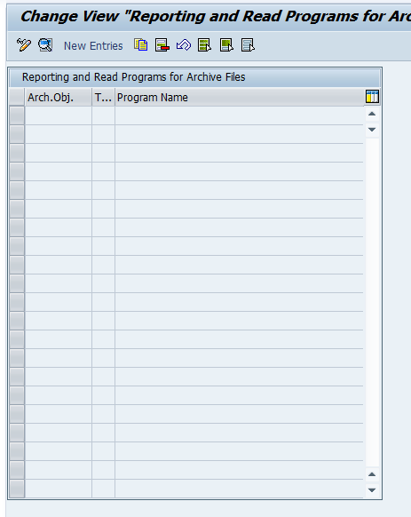

Originally posted at https://blogs.sap.com/2013/08/22/add-a-selection-screen-to-a-table-maintenance-dialog/.

When end users will maintain a z-table with 100+ rows, it helps to be able to restrict the selection by any number of selection criteria.  This document attempts to define a “best practice” method for calling a table maintenance dialog from a selection screen.

Current Table Maintenance

The standard way to show a table maintenance dialog is via SM30, Call View Maintenance –

– or a custom parameter transaction that calls SM30 for a specific table, with parameters VIEWNAME and UPDATE = ‘X’.

Neither of these provide an initial selection screen.  Entries can be restricted by checking the “Enter conditions” radiobutton, but users are more familiar with selection screens than with the dialog box that pops up.  Therefore it is good UI to use a selection screen instead of the “Enter conditions” radiobutton.

Example Selection Screen Definition

In this example, an executable report has been created with selection screen.

REPORT  z_maintain_mytable.

DATA mytable    TYPE z_mytable.

DATA selections TYPE TABLE OF vimsellist.

DATA selection  TYPE vimsellist.

SELECT-OPTIONS: so_selop1 FOR mytable–myfield1,

                 so_selop2 FOR mytable–myfield2.

PARAMETERS: p_param1 TYPE z_mytable–myfield3,

             p_param2 TYPE z_mytable–myfield4.

Calling Function Modules

When the user clicks execute, the program needs to read their selections and call the table maintenance dialog.  The following code shows how this is easily done by using function modules ‘VIEW_RANGETAB_TO_SELLIST’ and ‘VIEW_MAINTENANCE_CALL’.

START-OF-SELECTION.

  DEFINE addsel.

    CALL FUNCTION ‘VIEW_RANGETAB_TO_SELLIST’

      EXPORTING

        fieldname          = &1

        append_conjunction = ‘AND’

      TABLES

        sellist            = selections

        rangetab           = &2[].

  END-OF-DEFINITION.

  DEFINE addparam.

    IF &2 IS NOT INITIAL.

      CLEAR selection.

      selection–viewfield = &1.

      selection–value = &2.

      selection–and_or = ‘AND’.

      selection–operator = ‘EQ’.

      APPEND selection TO selections.

    ENDIF.

  END-OF-DEFINITION.

  add_sel ‘MYFIELD1’ so_selop1.

  add_sel ‘MYFIELD2’ so_selop2.

  add_par ‘MYFIELD3′ p_param1.

  add_par ‘MYFIELD4′ p_param2.

  CALL FUNCTION ‘VIEW_MAINTENANCE_CALL’

    EXPORTING

      action                = ‘U’ “for Update

      view_name             = ‘Z_MYTABLE’

      complex_selconds_used = ‘X’

    TABLES

      dba_sellist           = selections

    EXCEPTIONS

      OTHERS                = 1.

  IF sy–subrc = 1.

    MESSAGE ID sy–msgid TYPE sy–msgty NUMBER sy–msgno

               WITH sy–msgv1 sy–msgv2 sy–msgv3 sy–msgv4.

  ENDIF.

Horray!  That is all. In only 46 lines (plus two for every select-option or parameter), this will bring the user to from the selection-screen to the table maintenance screen.

This is a collaborative document.  If there are better ways of achieving this functionality don’t hesitate to chime in and contribute!
