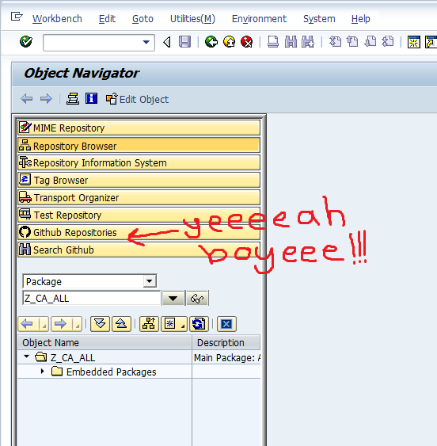

Originally posted at https://blogs.sap.com/2013/09/18/a-dream-for-se80-github-integration/

When I heard Code Exchange was closing, I was bummed.  I read that a new code exchange 2.0 is being developed, but as I write this it is still under construction.  As many people have pointed out, however, that doesn’t need to stop SAP developers from sharing code with one another.

For us ABAPers, we have few choices on how to share code, and it’s not easy to share non-code development objects.  For simple programs, I can copy and paste from any forum, but what about a program has a dozen custom data elements and a few custom global classes?  Well, thanks to the fantastic SAPLink project (with which I am not affiliated), that has become a lot easier.  It’s as easy as downloading a .nugg file and importing it, or so I hear.

I want to take the idea behind SAPLink one step further.  Instead of searching the web via browser (and by the web, I mean Google Code and Github) for a .nugg file, downloading it to a file directory, and importing it via SAPGUI, can’t we do this all from SAPGUI?  We’re trying to share code, so why not share while using the place where we work on the code, i.e. SE80?  If you’re thinking, “That’s not where I work on the code!  I use Eclipse!” well, good for you.  I hope to join your smug ranks soon, but most of what I’m proposing is probably applicable to Eclipse development too.  Certainly an ABAP-based github client is reusable.

So rather than spending 5 minutes explaining it, I spent half an hour stumbling through MS Paint, drawing what I had in mind.

Seriously, how cool would this be?

From what I can tell, although it’s not possible to add tools to SE80 like this, it would still be very helpful to copy the general UI into another transaction.  It could have two or three pushbuttons on the left like SE80, but they would be along the lines of Github Repositories, Search Github, and Package Browser.  From github repositories, you could view your own repos.  Search Github would return a results list of repos, from which you could view the contents, readme, and import as an SAP development package.  Package Browser would allow a user to select and push his or her development packages to github.

Right now I’m thinking a 1-to-1 ratio of packages to repositories would work best for code management and sharing.  If I download/clone a repository, it becomes a package, and if I push a package to github, it becomes a repository, and any subpackages do not – they are just part of the .nugg file.

There are a few problems that need answers if this will get developed, such as how to handle the github readme files, but boy howdy, this would be a dream come true.

If this were developed, would you use it?  What other features would you like to see?
