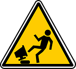
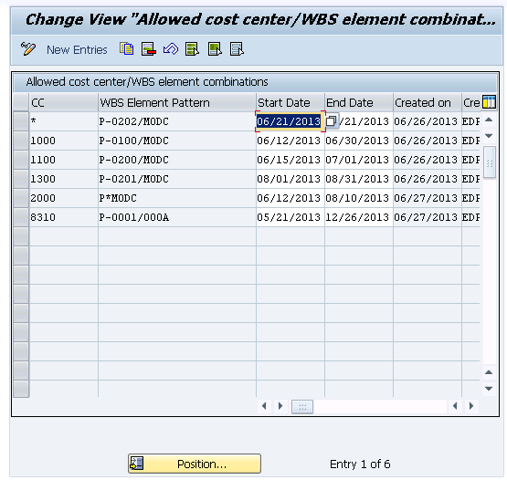
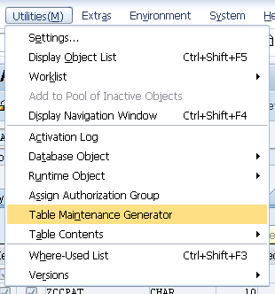
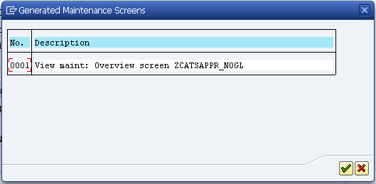
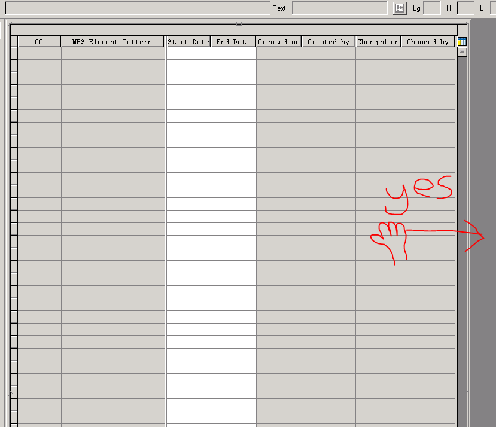
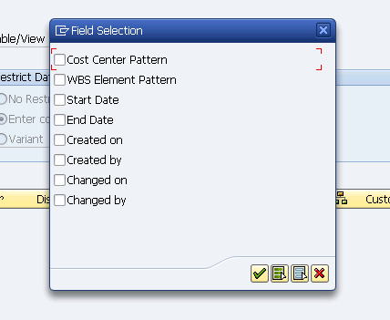

Originally posted at https://blogs.sap.com/2013/10/01/best-practices-for-users-to-maintain-a-z-table/

UI design is one of the most exciting parts about my job as a developer.  It is art, programming, and psychology at the same time.  A few weeks ago I had the requirement to create a table maintenance program for our business users to maintain a large custom database table.  A few administrators were then going to add, modify and delete entries in this custom table that would in turn be used by other background programs.  Sounds simple, I thought.  It wasn’t.  I learned a lot about creating a table maintenance dialog, not the least of which was how to spell “maintenance” correctly.  I wanted to summarize a few things I learned from this adventure.

Bad Doctors, T.V. Writers and User Interfaces
The television show The Walking Dead is getting ready to premiere its fourth season and has the highest viewership among any cable TV show in the U.S.  It also received much criticism for being very slow-moving and having “filler episodes” some weeks with little to no action.  “Our heroes should be fighting off more zombies and rescuing other survivors in the post-apocalyptic world,” said the fans.  But the writers knew better.  An hour of baseball bats and machine guns and blood n’ guts every week would get old quickly.  So the writers added complex father-son relationships, outcasts trying to find their place, and familiar love triangles set amidst an extreme environment.  As a result, people kept watching.

Likewise, If I went to the doctor and he or she said “I’m not sure what to prescribe, let me know what medicine you want and I’ll give that to you,” I’d run out of the clinic as fast as possible.  Actually I might steal all the tongue depressors on the way out, because I’m never returning to that doctor, and tongue depressors intrigue me.

What’s the point of these examples?  I’m trying to show that the consumer often doesn’t know what they want.  I’m not going to crowdsource medical advice, and neither will I give the user the interface they tell me they want.  I’m going to tell him or her what’s best, because I’m a designer/developer and they don’t know the appropriate time to use a radiobutton vs. a checkbox, let alone design the screen layout and flow for a program they need.

Certainly you, the developer, need to listen closely to the user’s needs (and to any functional analyst) but the technical details of the final application, including UI “feel,” ought to be your responsibility.  Users and functional types may strongly disagree with your UI choices, so it is important to communicate as clearly and effectively as possible.  You must convince them why their UI is the wrong choice.  In this age of agile development, it’s not a good excuse to say “But I gave you exactly what the design spec asked for!” when the user whines about your program.

If you give the user exactly what they want, they’ll likely be back every month wanting some little change in the program.  If you seek to understand their need and argue well for a better (read: more standard) UI, they will be very pleased with the final result, and the program will require less maintenance over its lifecycle.

Users and Z-Tables
Now that I’ve got that rant out of the way, one of the toughest UI challenges for me was creating a table maintenance dialog.  TMD’s, as I’ll call them, are programs with a very simple task that are very complicated “under the hood.”  I’ve compiled nine tips and tricks about how to create one well.

1. This is 5% Table and 95% User
Any database table can be maintained by only the four CRUD operations (create, read, update, and delete).  So, how difficult can it be to put a front end on four different database operations?  Not difficult, if you’re okay with annoying everyone in your company, filling the database with bad data, and all-around mediocrity in your life.

If you want to implement a good table maintenance dialog, however, you need to worry about security, data validation, message handling, view restrictions, and more.  Users (at least the human ones) will do everything they can to screw up and misuse a program.  Some may be downright evil.  As said in a 2008 commentary about Craigslist spammers, “When you fail to design for evil, you have failed your community.”

Most TMD design requirements will fall into one of two categories:

Getting the correct slice of data FROM the database to the user’s display.
Making sure only good user input goes INTO the database.
2. Use SAP’s Table Maintenance Generator
The good news is, the bulk of a good table maintenance dialog will be built by SAP.  This may seem painfully obvious to some, but when I got the requirement to build a table maintenance dialog I was told, “We’ve done this for another Z-table before; here is a program for you to copy.”  The program was a module pool with 1300 lines of code, 7 dynpro screens, and five GUI statuses.  All to create, read, change, and delete entries from one database table!  I would not let that program near children.

If you didn’t know, SAP transaction SM30 allows end-users to maintain database tables directly.  It’s far prettier than any dialog you have time to create, and you can use the ABAP dictionary to integrate your custom table into this transaction.

Isn’t it (comparatively) pretty?

Table maintenance dialogs are deceptively complex.  To keep the amount of code you need to write under control, stay as close to SAP standard as possible.  To save you and your coworkers many headaches, generate a table maintenance dialog the standard way.  If you don’t know how, here’s the documentation.

SAP Library – Create a Table Maintenance Dialog.

Now you’ve got a program that allows users to maintain a table.  And you wrote zero lines of code!  You must be an amazing programmer.  You can maintain the table via SM30 (Call View Maintenance) now.

3. Use a Custom Transaction Instead of SM30
At my company, end users do not have access to transaction SM30.  That was the justification given to me when I asked about another custom table maintenance dialog for a different Z-Table (In all fairness, this reinvented wheel was only 300 lines of code and three dynpros).  Instead of using transaction SM30 to maintain a table, there are two better ways to use the table maintenance dialog, and you won’t have to create any dynpro screens.  Have I mentioned I hate dynpros?

Parameter Transaction: Requires no ABAP.  From SE93, create a new transaction.  When prompted for the type, choose “parameter transaction.”  Set SM30 as the default transaction and check “skip initial screen.”  This works great for tables that won’t have many entries – my rule of thumb is fifty or less.

Add the following default values:

Field     Value                 

UPDATE    X

VIEWNAME  (name of your Z-Table)

ABAP Report: Easier to customize.  Build a custom report and call function module “VIEW_MAINTENANCE_CALL”.  This requires maintenance of a custom report, but it has all the flexibility of an ABAP program.  This is a big advantage if you want to add a selection screen or build the TMD into another application.

4. Widen the Overview Window for Tables With 5-10 Fields.
Making your users scroll horizontally is as annoying as websites that automatically play music or game invitations from distant friends on Facebook.  If you have more than 4 fields in the table, this is essential!

Rule of thumb: Be less annoying than this.

To change the standard screen:

From SE11 (ABAP Dictionary), open the screen to modify your Z-Table.  On the menu, choose Utilities ->Table Maintenance Generator.

From the menu, choose Environment -> Modification -> Maintenance Screens and select the screen you want to change.

To widen the overview window, click “Layout” and simply drag the side of the table control to widen it.  If there are a great many fields, you may not be able to fit all of them on the screen.  Your users would have to scroll horizontally, and now would be appropriate for you to shed a tear.  Save and activate the screen.

I’ve recently seen another way of doing this via an enhancement which is slightly more complicated, but far more adaptive and robust. It’s described in the blog SM30, change standard width of Tablecontrol.

5. Use a Two-Step Dialog for Tables with 10+ fields.

If the table has more than 10 fields, you’ll be unable to avoid making your users scroll horizontally.  One way to make this easier is to use a two-step dialog.  When the users add a new entry, they will be taken to a separate screen where they can edit all the fields for one record.

6. Disable Input for Read-only Fields WITHOUT Creating a Database View.

One way to disable input is to mark the fields as “Read-Only” in the ABAP dictionary, but this is only possible for database views, not transparent tables.  If you are working with a transparent table and not a maintenance view, customizing this screen is easier than creating and maintaining a separate database view.  Open the screen for modification as in step 4.  Click the “Element List” tab and un-check the boxes in the Input column for those fields you do not want users to control (in case you will be filling them in automatically with custom code).  Examples of this are “Created By” and “Created On.” 

7. Use Custom Logic When Appropriate.
A good database table needs validated, clean data.  If you cannot ensure this via check tables in the table definition, there are many points in the SAP standard dialog where you can add custom code to validate entries or do whatever else you need.  Enhancing a table maintenance dialog can get complicated, however, so the ins and outs will not be discussed here.

Some great resources for those who are interested:

Table Maintenance Generator and its Modifications

SAP Library – Extended Table Maintenance Events.

8. Add a Custom Selection Screen for 50+ Records
If the custom table is large, its administrators may not want to see every entry on the overview screen.  They want to see if specific entries exist before adding new ones. This was a requirement by my business, and based on an SCN search for “filter sm30 selection screen,” I saw others had the same need.

It’s quite easy to restrict the display via SM30, but this is only after everything has been loaded.  The built-in selection criteria also gives only a small dialog box (not to mention you’re directly using SM30).

This is no selection screen for end users!

Instead, it’s better to create a custom report with select-options that calls the function module “VIEW_MAINTENANCE_CALL” I mentioned above. The FM requires all the select-options to be in one parameter.  Here are the highlights of the code needed for that.

Add a Selection Screen to a Table Maintenance Dialog

9. Integrate Your TMD Into a View Cluster or Config Table
Once the INNER workings of a table maintenance dialog are optimized for user pleasure, give it context in the OUTSIDE environment.  Add it to a view cluster so multiple related tables can be maintained at once, or add it to the IMG config settings if appropriate.

These activities are detailed in two entries from my favorite series on SCN (so far):

Getting the basics right – Creating the perfect config table (Part 2, View Clusters)

Getting the basics right – Creating the perfect config table (Part 4, IMG integration)

Good UI Goes a Long Way

If this is done well, users will be happy, or at least not angry, and that’s what we developers all hope for.  Less time will be spent responding to users’ little requests in the future, and you will be far better off for it.

So, what other ways have you been able to improve upon the standard TMD?
